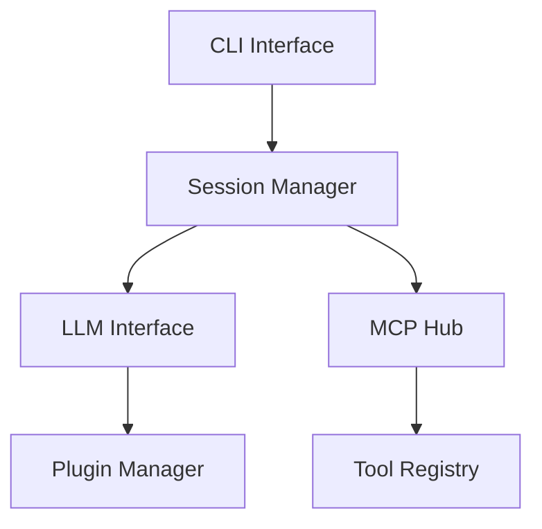

# MCPilot

A general-purpose system that executes tasks using MCP tooling through prompt-based interactions.

## Features

- Plugin-based LLM provider system supporting multiple backends
- Robust session management with context preservation
- Tool integration through MCP protocol
- Extensible architecture with clean interfaces
- Comprehensive logging and error handling
- CLI interface for interactive use

## Installation

```bash
npm install mcpilot
```

## Quick Start

```typescript
import { createSession, LogLevel } from 'mcpilot';

async function main() {
    // Create a new session
    const session = await createSession({
        contextSize: 4096,
        logLevel: LogLevel.INFO
    });

    // Process messages
    const response = await session.processMessage(
        'Hello! Can you help me with some programming tasks?'
    );
    
    console.log('Response:', response.content);

    // Clean up
    await session.endSession();
}
```

## Architecture

MCPilot is designed with a modular, plugin-based architecture:

- **Session Management**: Handles conversation context, message flow, and state tracking
- **LLM Providers**: Pluggable system for different LLM backends (OpenAI, Anthropic, Local)
- **MCP Integration**: Tool execution through Model Context Protocol
- **CLI Interface**: Command-line interface for interactive use

### Core Components



## Configuration

Create a configuration file `mcpilot.config.js`:

```javascript
module.exports = {
    providers: {
        openai: {
            apiKey: process.env.OPENAI_API_KEY,
            model: 'gpt-4'
        },
        anthropic: {
            apiKey: process.env.ANTHROPIC_API_KEY,
            model: 'claude-2'
        }
    },
    session: {
        logDirectory: './sessions',
        contextSize: 4096,
        maxQueueSize: 100
    },
    logging: {
        level: 'info',
        format: 'json'
    }
};
```

## CLI Usage

```bash
# Start a new session
mcpilot start --model gpt-4

# Resume an existing session
mcpilot resume ./sessions/session_123.log

# Execute a message
mcpilot execute "What is the factorial of 5?"

# Check session status
mcpilot status

# End session
mcpilot end
```

## API Documentation

### Session Management

```typescript
import { createSession, resumeSession } from 'mcpilot';

// Create new session
const session = await createSession(options);

// Resume existing session
const resumedSession = await resumeSession(logPath);

// Process messages
const response = await session.processMessage(message);

// Save session state
await session.save();

// End session
await session.endSession();
```

### Provider System

```typescript
import { createProviderFactory, ProviderType } from 'mcpilot';

// Create provider factory
const factory = createProviderFactory();

// Register custom provider
factory.register(ProviderType.CUSTOM, myProviderCreator);

// Create provider instance
const provider = factory.create(ProviderType.OPENAI, config);
```

## Contributing

1. Fork the repository
2. Create your feature branch (`git checkout -b feature/amazing-feature`)
3. Commit your changes (`git commit -m 'Add amazing feature'`)
4. Push to the branch (`git push origin feature/amazing-feature`)
5. Open a Pull Request

## Testing

```bash
# Run all tests
npm test

# Run specific test suite
npm test -- --testPathPattern=session

# Run with coverage
npm test -- --coverage
```

## License

ISC License

## Credits

Built with:
- TypeScript
- Node.js
- Model Context Protocol