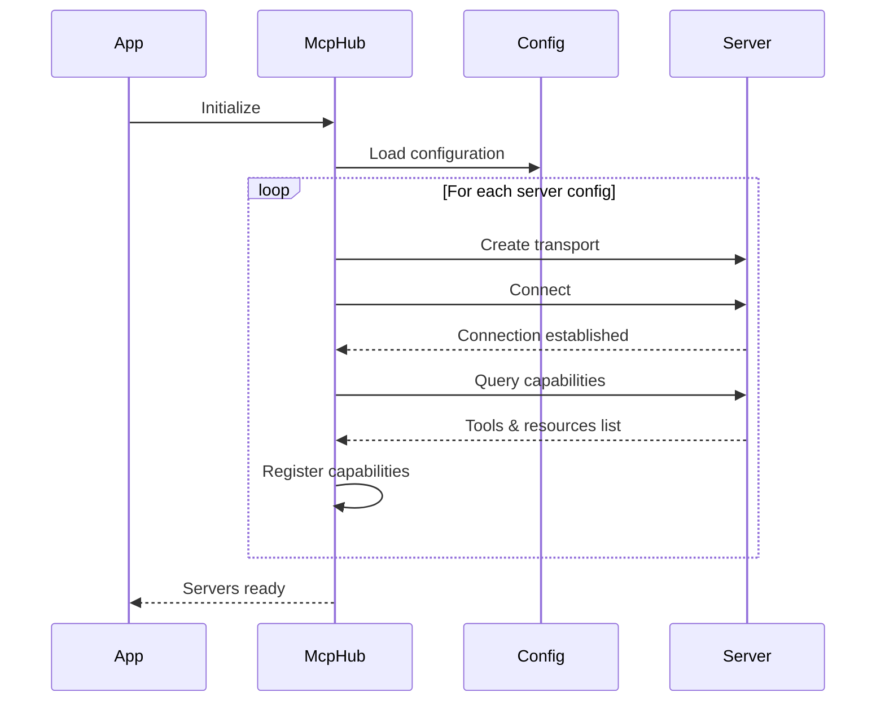
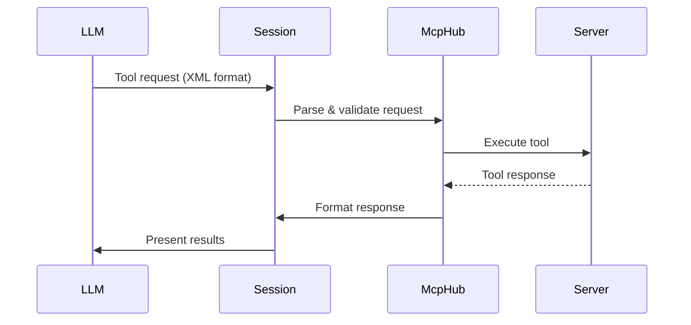
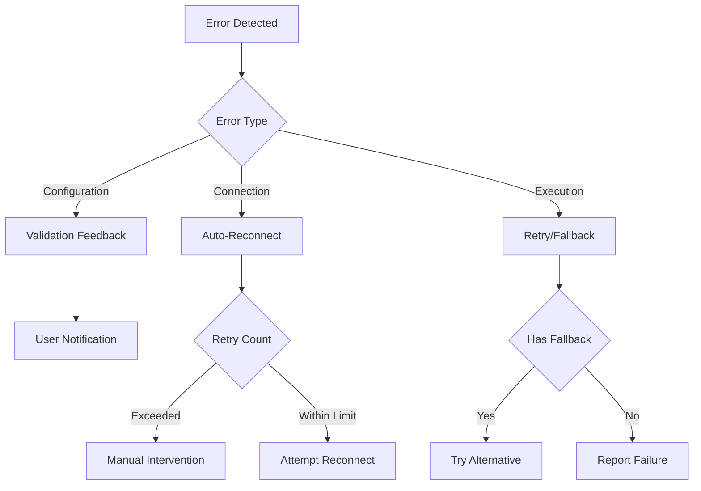

# MCP Integration Design

## Overview

This document details the design for Model Context Protocol (MCP) integration in MCPilot. The integration enables dynamic discovery and utilization of external tools through MCP servers, allowing the LLM to interact with system resources and external services.

## 1. Configuration Format

### MCP Server Configuration

```json
{
  "mcpServers": {
    "server-name": {
      "command": "command-to-run",
      "args": ["array", "of", "arguments"],
      "env": {
        "ENV_VAR": "value"
      },
      "disabled": false,
      "timeout": 60,
      "alwaysAllow": []
    }
  }
}
```

Configuration fields:
- `command` (required): The command to run the MCP server
- `args` (optional): Array of command-line arguments
- `env` (optional): Environment variables for the server process
- `disabled` (optional): Whether the server is disabled (default: false)
- `timeout` (optional): Server request timeout in seconds (default: 60)
- `alwaysAllow` (optional): Array of tool names to always allow without confirmation

### Configuration Location

The configuration file is stored at:
- VSCode Extension: `<User Settings>/cline_mcp_settings.json`
- Claude Desktop: `<App Data>/claude_desktop_config.json`

## 2. Server Discovery Flow



1. On startup, McpHub loads the MCP configuration file
2. For each configured server:
   - Creates StdioTransport with server process
   - Establishes connection via MCP protocol
   - Queries available tools and resources
   - Registers capabilities in internal registry
3. Connection status and errors are tracked per server
4. Servers can be enabled/disabled dynamically
5. Configuration changes trigger reconnection

## 3. Tool Representation Schema

### Tool Definition

```typescript
interface McpTool {
  name: string;
  description: string;
  inputSchema: ToolSchema;
  alwaysAllow: boolean;
}

interface ToolSchema {
  type: string;
  properties: Record<string, any>;
  required?: string[];
  additionalProperties?: boolean;
}
```

### LLM Tool Format

Tools are presented to the LLM in a standardized XML-style format:

```xml
<tool_name>
<parameter1_name>value1</parameter1_name>
<parameter2_name>value2</parameter2_name>
</tool_name>
```

Each tool includes:
1. Description of functionality
2. Required and optional parameters
3. Parameter validation rules
4. Usage examples
5. Response format specification

## 4. Conversation Protocol

### Tool Execution Flow



1. LLM generates tool request in XML format
2. Session manager parses and validates request
3. McpHub routes request to appropriate server
4. Server executes tool and returns response
5. Response is formatted and returned to LLM
6. LLM incorporates results in conversation

### Response Handling

Tool responses can include:
- Text content
- Image data
- Resource references
- Error indicators

## 5. Error Handling

### Error Categories

1. Configuration Errors
   - Invalid server configuration
   - Missing required fields
   - Invalid parameter types

2. Connection Errors
   - Server start failure
   - Connection timeout
   - Transport errors

3. Tool Execution Errors
   - Invalid parameters
   - Execution timeout
   - Server errors
   - Resource access errors

### Recovery Strategies



1. Automatic Recovery
   - Connection retry with backoff
   - Tool execution retry
   - Fallback options when available

2. Manual Intervention
   - Clear error notifications
   - Configuration guidance
   - Server restart option
   - Detailed error logs

3. Error Reporting
   - Structured error messages
   - Error categorization
   - Stack traces for debugging
   - Server stderr capture

## Implementation Plan

### Phase 1: Config Parser & Validation
- [x] Define configuration schema
- [x] Implement config file loading
- [x] Add validation rules
- [x] Handle config updates

### Phase 2: McpHub Connection Manager
- [x] Implement server process management
- [x] Add connection lifecycle handling
- [x] Implement status tracking
- [x] Add reconnection logic
### Phase 3: Tool Catalog Builder
- [x] Design tool registry interface
- [x] Implement capability discovery
- [x] Add schema validation
- [x] Create documentation generator

### Phase 4: System Prompt Enhancer
- [x] Define tool documentation format
- [x] Create tool usage examples
- [x] Implement dynamic prompt injection
- [x] Add context management

### Phase 5: Tool Request Parser
- [x] Implement XML parser
- [x] Add parameter validation
- [x] Create error formatter
- [x] Add retry logic

### Phase 6: Execution Router
- [x] Implement request routing
- [x] Add load balancing
- [x] Create connection pool
- [x] Add timeout handling

### Phase 7: Response Formatter
- [x] Define response schema
- [x] Add content type handling
- [x] Implement error wrapping
- [x] Create result formatter

### Phase 8: Conversation Controller
- [x] Add context tracking
- [x] Implement state management
- [x] Create session handler
- [x] Add cleanup logic
- [ ] Add cleanup logic

## Testing Strategy

1. Unit Tests
   - Configuration parsing
   - Tool validation
   - Response formatting
   - Error handling

2. Integration Tests
   - Server connections
   - Tool execution
   - Error recovery
   - Configuration updates

3. End-to-End Tests
   - Full conversation flow
   - Tool interaction scenarios
   - Error recovery paths
   - Performance benchmarks