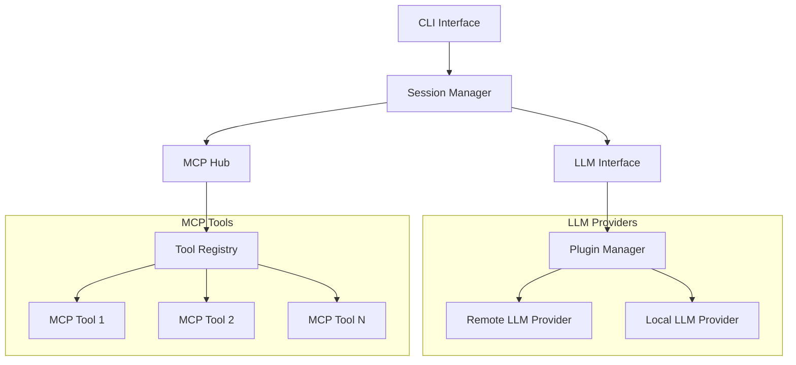
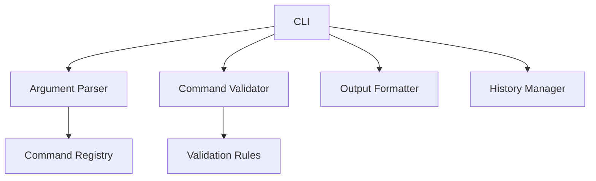
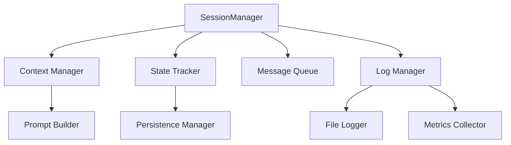
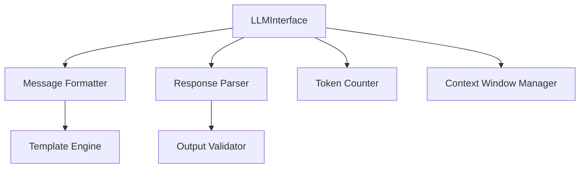
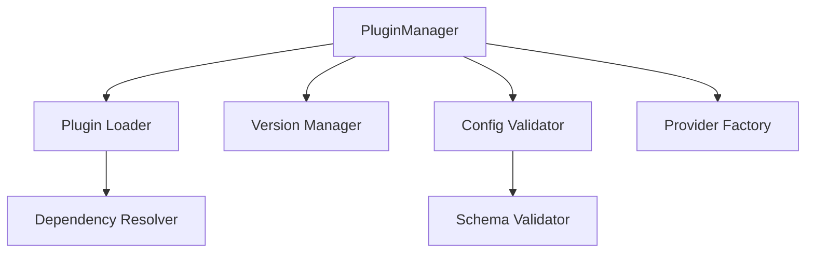
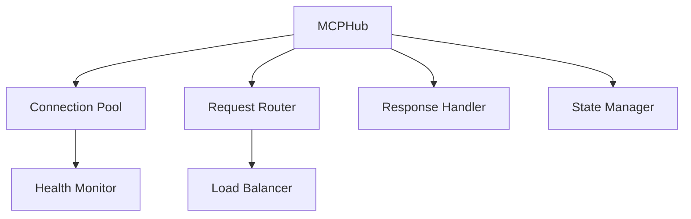
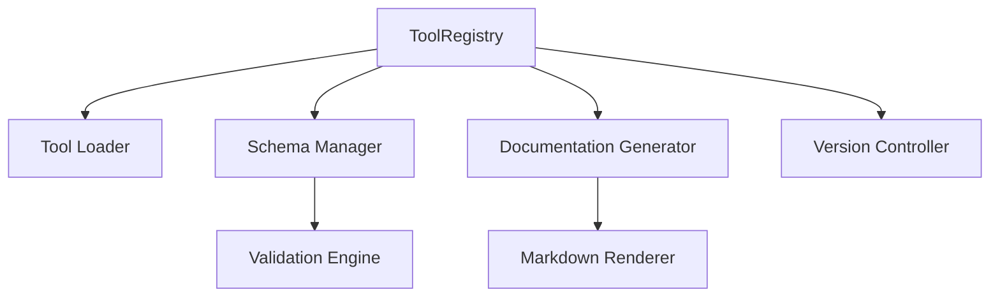
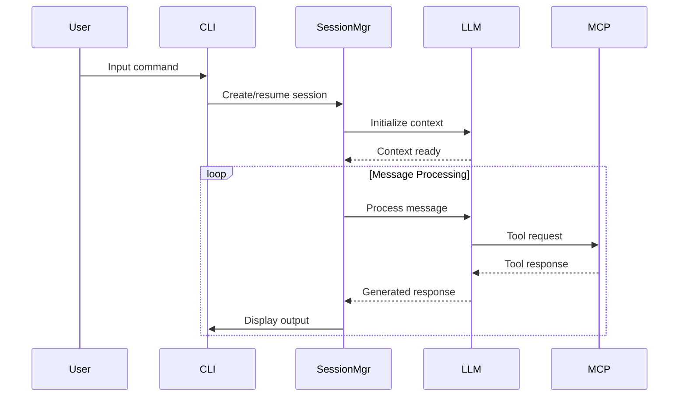

# MCPilot System Architecture Proposal

## 1. High-Level Component Mapping

### Core Components



### Low-Level Implementation Mapping

#### CLI Interface Layer


#### Session Management Layer


#### LLM Interface Layer


#### Plugin Management Layer


#### MCP Hub Layer


#### Tool Registry Layer


### Subcomponent Details

#### CLI Interface Layer
- **Argument Parser**: Processes command-line arguments and flags
- **Command Validator**: Validates command syntax and parameters
- **Output Formatter**: Formats responses for terminal display
- **History Manager**: Manages command history and session restoration
- **Command Registry**: Stores available command definitions
- **Validation Rules**: Defines command validation rules

#### Session Management Layer
- **Context Manager**: Maintains conversation context
- **State Tracker**: Tracks session state and transitions
- **Message Queue**: Manages message processing queue
- **Log Manager**: Coordinates logging activities
- **Prompt Builder**: Constructs context-aware prompts
- **Persistence Manager**: Handles state persistence
- **File Logger**: Implements file-based logging
- **Metrics Collector**: Collects session metrics

#### LLM Interface Layer
- **Message Formatter**: Formats messages for LLM
- **Response Parser**: Parses LLM responses
- **Token Counter**: Tracks token usage
- **Context Window Manager**: Manages context window size
- **Template Engine**: Handles prompt templates
- **Output Validator**: Validates LLM outputs

#### Plugin Management Layer
- **Plugin Loader**: Loads provider plugins
- **Version Manager**: Manages plugin versions
- **Config Validator**: Validates plugin configs
- **Provider Factory**: Creates provider instances
- **Dependency Resolver**: Resolves plugin dependencies
- **Schema Validator**: Validates config schemas

#### MCP Hub Layer
- **Connection Pool**: Manages MCP connections
- **Request Router**: Routes tool requests
- **Response Handler**: Processes tool responses
- **State Manager**: Manages tool state
- **Health Monitor**: Monitors connection health
- **Load Balancer**: Balances tool requests

#### Tool Registry Layer
- **Tool Loader**: Loads tool definitions
- **Schema Manager**: Manages tool schemas
- **Documentation Generator**: Generates tool docs
- **Version Controller**: Controls tool versions
- **Validation Engine**: Validates tool inputs
- **Markdown Renderer**: Renders tool documentation

### Component Responsibilities

1. **CLI Interface**
=======
   - Handles user input/output
   - Manages session initialization
   - Provides command-line arguments parsing
   - Supports session restoration from logs

2. **Session Manager**
   - Coordinates message flow
   - Manages context and state
   - Handles logging and persistence
   - Orchestrates tool execution

3. **LLM Interface**
   - Abstracts LLM provider interactions
   - Implements provider-agnostic protocol
   - Manages message formatting
   - Handles response parsing

4. **Plugin Manager**
   - Loads LLM provider plugins
   - Manages provider lifecycle
   - Handles provider configuration
   - Ensures provider compatibility

5. **MCP Hub**
   - Manages MCP server connections
   - Routes tool requests
   - Handles tool response processing
   - Maintains tool state and configuration

6. **Tool Registry**
   - Registers available tools
   - Validates tool configurations
   - Provides tool documentation
   - Manages tool versioning

## 2. Service Boundaries and Interactions

### Service Communication Flow



### API Boundaries

1. **Internal APIs**
   - Session management API
   - Plugin interface
   - Tool execution protocol
   - Logging interface

2. **External APIs**
   - CLI command interface
   - LLM provider interface
   - MCP server protocol
   - Configuration API

## 3. Required Infrastructure

1. **Development Tools**
   - TypeScript/Node.js environment
   - Build system (e.g., webpack, tsc)
   - Testing framework
   - CI/CD pipeline

2. **Runtime Infrastructure**
   - Node.js runtime
   - File system access
   - Network connectivity
   - Process management

3. **Monitoring & Operations**
   - Logging infrastructure
   - Metrics collection
   - Error tracking
   - Performance monitoring

## 4. Data Flow Architecture

### Message Flow

```mermaid
graph LR
    subgraph "Input Processing"
        UserInput[User Input] --> Parser[Command Parser]
        Parser --> Validator[Input Validator]
    end
    
    subgraph "Context Management"
        Validator --> SessionCtx[Session Context]
        SessionCtx --> PromptMgr[Prompt Manager]
    end
    
    subgraph "Execution"
        PromptMgr --> LLMExec[LLM Execution]
        LLMExec --> ToolExec[Tool Execution]
    end
    
    subgraph "Output Processing"
        ToolExec --> ResponseFormat[Response Formatter]
        ResponseFormat --> Logger[Session Logger]
        Logger --> UserOutput[User Output]
    end
```



## 5. Component Interfaces

### Core Interfaces

```typescript
interface ISessionManager {
    createSession(): Session;
    resumeSession(logPath: string): Session;
    executeMessage(message: string): Promise<Response>;
    saveContext(): void;
}

interface ILLMProvider {
    initialize(config: ProviderConfig): Promise<void>;
    processMessage(context: Context): Promise<Response>;
    shutdown(): Promise<void>;
}

interface IMCPHub {
    registerTool(tool: Tool): void;
    executeTool(request: ToolRequest): Promise<ToolResponse>;
    getAvailableTools(): Tool[];
}
```

### Component Interfaces

#### CLI Interface Layer

```typescript
interface IArgumentParser {
    parse(args: string[]): ParsedArgs;
    validateArgs(args: ParsedArgs): boolean;
    getUsage(): string;
}

interface ICommandValidator {
    validate(command: Command): ValidationResult;
    registerValidationRule(rule: ValidationRule): void;
    getValidationErrors(): ValidationError[];
}

interface IOutputFormatter {
    format(response: Response): string;
    setTheme(theme: FormatterTheme): void;
    supportedFormats(): string[];
}

interface IHistoryManager {
    saveCommand(command: Command): void;
    getHistory(limit?: number): Command[];
    restore(sessionId: string): SessionHistory;
    clear(): void;
}

interface ICommandRegistry {
    register(command: CommandDefinition): void;
    get(name: string): CommandDefinition | null;
    list(): CommandDefinition[];
    remove(name: string): boolean;
}

#### Session Management Layer

```typescript
interface IContextManager {
    updateContext(data: ContextData): void;
    getContext(): Context;
    clearContext(): void;
    mergeContext(newContext: Partial<Context>): void;
}

interface IStateTracker {
    getCurrentState(): SessionState;
    transition(newState: SessionState): boolean;
    getHistory(): StateTransition[];
    reset(): void;
}

interface IMessageQueue {
    enqueue(message: Message): void;
    dequeue(): Message | null;
    peek(): Message | null;
    size(): number;
}

interface ILogManager {
    log(level: LogLevel, message: string, metadata?: object): void;
    getLogStream(sessionId: string): ReadableStream;
    setLogLevel(level: LogLevel): void;
    rotate(): Promise<void>;
}

interface IPromptBuilder {
    addSystemPrompt(prompt: string): void;
    addUserMessage(message: string): void;
    addContext(context: Context): void;
    build(): string;
}

interface IPersistenceManager {
    save(state: SessionState): Promise<void>;
    load(sessionId: string): Promise<SessionState>;
    exists(sessionId: string): Promise<boolean>;
    cleanup(maxAge: number): Promise<void>;
}

#### LLM Interface Layer

```typescript
interface IMessageFormatter {
    format(message: Message, format: MessageFormat): string;
    addTemplate(name: string, template: string): void;
    validate(message: Message): boolean;
    getSupportedFormats(): MessageFormat[];
}

interface IResponseParser {
    parse(response: string): ParsedResponse;
    extractTools(response: string): Tool[];
    validate(response: string): ValidationResult;
    getSchema(): ResponseSchema;
}

interface ITokenCounter {
    countTokens(text: string): number;
    estimateTokens(message: Message): number;
    getLimit(): number;
    getUsage(): TokenUsage;
}

interface IContextWindowManager {
    add(content: string): boolean;
    remove(content: string): boolean;
    getCurrentSize(): number;
    trim(targetSize: number): void;
}

#### Plugin Management Layer

```typescript
interface IPluginLoader {
    load(path: string): Promise<Plugin>;
    unload(pluginId: string): Promise<void>;
    getLoaded(): Plugin[];
    validatePlugin(plugin: Plugin): boolean;
}

interface IVersionManager {
    checkCompatibility(version: string): boolean;
    upgrade(plugin: Plugin): Promise<void>;
    rollback(plugin: Plugin): Promise<void>;
    getVersionHistory(pluginId: string): Version[];
}

interface IConfigValidator {
    validate(config: PluginConfig): ValidationResult;
    addSchema(schema: ConfigSchema): void;
    removeSchema(schemaId: string): void;
    getErrors(): ValidationError[];
}

interface IProviderFactory {
    create(type: ProviderType, config: ProviderConfig): Provider;
    register(type: ProviderType, factory: ProviderCreator): void;
    getAvailableTypes(): ProviderType[];
    dispose(provider: Provider): void;
}

#### MCP Hub Layer

```typescript
interface IConnectionPool {
    acquire(): Promise<Connection>;
    release(connection: Connection): void;
    status(): PoolStatus;
    configure(config: PoolConfig): void;
}

interface IRequestRouter {
    route(request: ToolRequest): Promise<Route>;
    register(pattern: RoutePattern, handler: RouteHandler): void;
    unregister(pattern: RoutePattern): void;
    getRoutes(): Route[];
}

interface IResponseHandler {
    handle(response: ToolResponse): Promise<void>;
    addMiddleware(middleware: ResponseMiddleware): void;
    removeMiddleware(id: string): void;
    getMiddleware(): ResponseMiddleware[];
}

interface IStateManager {
    setState(key: string, value: any): void;
    getState(key: string): any;
    clear(): void;
    snapshot(): StateSnapshot;
}

#### Tool Registry Layer

```typescript
interface IToolLoader {
    loadTool(path: string): Promise<Tool>;
    unloadTool(toolId: string): Promise<void>;
    refresh(): Promise<void>;
    getLoadedTools(): Tool[];
}

interface ISchemaManager {
    addSchema(schema: ToolSchema): void;
    validate(tool: Tool): ValidationResult;
    getSchema(toolId: string): ToolSchema;
    updateSchema(schema: ToolSchema): void;
}

interface IDocGenerator {
    generate(tool: Tool): Documentation;
    setTemplate(template: DocTemplate): void;
    getBatch(tools: Tool[]): Documentation[];
    export(format: DocFormat): string;
}

interface IVersionController {
    register(version: ToolVersion): void;
    upgrade(toolId: string, targetVersion: string): Promise<void>;
    downgrade(toolId: string, targetVersion: string): Promise<void>;
    getVersions(toolId: string): ToolVersion[];
}
```

## 6. Applied Design Patterns

1. **Dependency Injection**
   - Provider injection for LLM services
   - Tool injection for MCP functionality
   - Configuration injection

2. **Repository Pattern**
   - Session storage
   - Configuration management
   - Tool registry

3. **Factory Pattern**
   - LLM provider creation
   - Tool instantiation
   - Session creation

4. **Observer Pattern**
   - Session event handling
   - Tool execution monitoring
   - Log management

5. **Strategy Pattern**
   - LLM provider selection
   - Tool execution strategies
   - Response formatting

## 7. Cross-Cutting Concerns

### Logging & Monitoring

1. **Structured Logging**
   - Session activities
   - Tool execution
   - Error tracking
   - Performance metrics

2. **Monitoring**
   - Resource usage
   - Response times
   - Error rates
   - Tool usage statistics

### Security

1. **Authentication**
   - API key management
   - Provider authentication
   - Session validation

2. **Authorization**
   - Tool access control
   - Resource limitations
   - Configuration restrictions

### Error Handling

1. **Error Categories**
   - Tool execution errors
   - Provider errors
   - Configuration errors
   - Runtime errors

2. **Recovery Strategies**
   - Automatic retry
   - Graceful degradation
   - Session recovery
   - Error reporting

## 8. Scalability Considerations

### Horizontal Scaling

1. **Stateless Components**
   - Session management
   - Tool execution
   - Response processing

2. **Load Distribution**
   - Provider load balancing
   - Tool request distribution
   - Session distribution

### Vertical Scaling

1. **Resource Optimization**
   - Memory management
   - CPU utilization
   - I/O optimization

2. **Performance Tuning**
   - Caching strategies
   - Connection pooling
   - Request batching

## 9. Technical Dependencies

### Core Dependencies

1. **Runtime**
   - Node.js >=16
   - TypeScript >=4.5

2. **Framework**
   - MCP SDK
   - LLM provider SDKs

3. **Infrastructure**
   - File system access
   - Network connectivity
   - Process management

### Optional Dependencies

1. **Monitoring**
   - Metrics collection
   - APM tools
   - Log aggregation

2. **Development**
   - Testing frameworks
   - Build tools
   - CI/CD tools

## 10. Error Handling Strategy

### Error Hierarchy

```typescript
class MCPilotError extends Error {
    code: string;
    severity: ErrorSeverity;
}

class ToolExecutionError extends MCPilotError {}
class ProviderError extends MCPilotError {}
class ConfigurationError extends MCPilotError {}
class SessionError extends MCPilotError {}
```

### Recovery Mechanisms

1. **Automatic Recovery**
   - Session restoration
   - Connection retry
   - Tool fallback

2. **Manual Intervention**
   - Error reporting
   - Debug information
   - Recovery instructions

## Implementation Plan

1. **Phase 1: Core Infrastructure**
   - Basic CLI interface
   - Session management
   - Logging system

2. **Phase 2: LLM Integration**
   - Provider interface
   - Plugin system
   - Message processing

3. **Phase 3: MCP Integration**
   - Tool registry
   - Execution engine
   - Response handling

4. **Phase 4: Advanced Features**
   - Error handling
   - Monitoring
   - Security implementation

5. **Phase 5: Optimization**
   - Performance tuning
   - Scale testing
   - Documentation